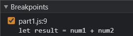
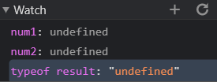
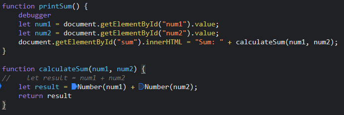

Breakpoints:

Watch:

1. The bug was that `result` added the two numbers as string values rather than numeric values. Thus, if `num1 = "1"` and `num2 = "2"`, `result = "12"` instead of `3` due to string concatenation.
2. I would fix it by converting `num1` and `num2` to `number` data type when declaring `result`, using Number(num1) and Number(num2):

3. citylots.json
4. part2.js
5. 11.7 MB
6. 70 ms
7. Mozilla/5.0 (Windows NT 10.0; Win64; x64) AppleWebKit/537.36 (KHTML, like Gecko) Chrome/89.0.4389.128 Safari/537.36
8. Apache
9.  Tue, 26 Jan 2021 22:14:13 GMT
10. application/json
11. fetch('./citylots.json')